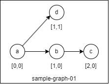

# tp-refactoring-graph-ts

> **TRAVAIL EN COURS**

## Description

Ce dépôt correspond au projet de départ pour le TP de refactoring sur les graphes du [cours sur les patrons de conception](https://github.com/mborne/cours-patron-conception#readme) donné à l'ENSG.

Le code est volontairement truffé d'erreurs de conception, l'idée du TP est d'y remédier progressivement.

## Pré-requis

* NodeJS >= 20 avec npm

## Utilisation

Après avoir forké et cloner le dépôt :

```bash
# installation des dépendances
npm install
# exécution des tests
npm run test
```

## Organisation du dépôt

Le dossier `src/model/` contient la modélisation des données avec :

* [src/model/Graph.ts](src/model/Graph.ts)
* [src/model/Edge.ts](src/model/Edge.ts)
* [src/model/Vertex.ts](src/model/Vertex.ts)

Le dossier `src/routing` contient les éléments relatifs au calcul de plus court chemin :

* [src/routing/RoutingService.ts](src/routing/RoutingService.ts)


## Organisation des tests

Les tests fonctionnels sont mis à disposition dans le dossier `test/` avec [test/helpers.ts](test/helpers.ts) permettant de créer des jeux tests :



Vous trouverez en particulier :

* [test/model/Graph.spec.ts](test/model/Graph.spec.ts) pour les tests de base sur [src/model/Graph.ts](src/model/Graph.ts)
* [test/routing/RoutingService.spec.ts](test/routing/RoutingService.spec.ts) pour les [src/routing/RoutingService.ts](src/routing/RoutingService.ts)

## Mises en garde

* Il est vivement conseillé d'**exécuter les tests à chaque étape en les adaptant au besoin**.
* La **correction du TP se fera sur la branche principale de votre fork**.
  * La moulinette de pré-correction ne pardonnera pas un échec d'exécution des tests.
  * Il est donc vivement conseillé de **travailler avec des branches** (0.1, 0.2, 0.3,...)
* Le TP était précédemment traité en Java (https://github.com/mborne/tp-refactoring-graph), l'adaptation est en cours pour TypeScript.

## Licence

[MIT](LICENSE)
